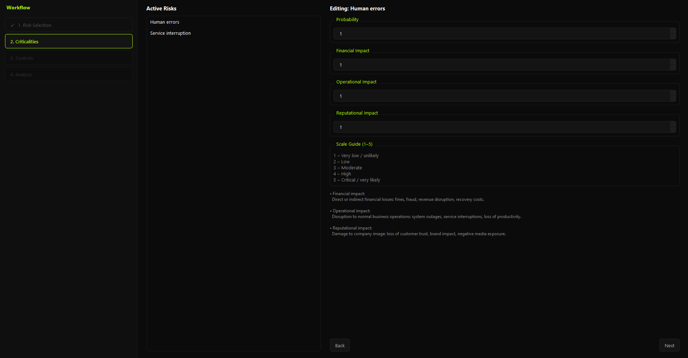

# Enterprise Risk Assessment Tool

A desktop application for structured risk analysis under the ERM/GRC framework. It quantifies inherent and residual risk exposure, evaluates the effectiveness of active controls, and estimates the financial cost of leaving risks unaddressed — helping decision-makers prioritize action rather than defer it.

---

## Key Features

- **Risk scoring with weighted impacts** — each risk is scored across financial, operational, and reputational dimensions, combined into a single exposure metric that reflects what actually matters to the organization.
- **Control effectiveness modeling** — controls are linked to specific risks with adjustable effectiveness rates, so residual exposure updates in real time as controls are added, removed, or tuned.
- **Cost of Inaction analysis** — a Monte Carlo simulation estimates the expected annual loss from the current risk portfolio under different investment scenarios (baseline, partial mitigation, full mitigation), with P50 and P90 percentile outputs.
- **Sensitivity and scenario comparison** — the model surfaces which risks drive the most loss and how outcomes shift across scenarios, making it easier to justify where to invest first.
- **Analytical dashboard** — four tabs covering the overall risk profile, priority risks, control coverage gaps, and scenario comparisons.
- **PDF report generation** — a full Cost of Inaction report can be exported as a PDF, suitable for executive review or audit documentation.
- **Standalone executable** — distributed as a single `.exe` (PyInstaller), requiring no Python installation on the target machine.

---

## How It Works

### Risk Model

Each risk carries a **probability** (1–5) and three **impact dimensions**:

| Dimension     | Weight |
|---------------|--------|
| Financial      | 40%    |
| Operational    | 30%    |
| Reputational   | 30%    |

**Inherent risk** = probability × weighted impact

**Residual risk** = inherent risk × remaining factor

Controls are aggregated **multiplicatively**, not additively. Each additional control reduces the remaining risk fraction further, but with diminishing returns. When *n* controls apply to the same risk, the model computes:

```
remaining factor = ∏(1 − eᵢ) ^ (1 / √n)
```

where *eᵢ* is each control's effectiveness. At *n* = 1 the exponent is 1.0 — standard reduction applies. At *n* = 4 the exponent drops to 0.5, and at *n* = 9 to 0.33, progressively returning more residual risk than a naive product would suggest. This penalizes over-stacking controls and prevents artificially low residual scores when many controls are assigned to a single risk.

### Classification

| Score     | Level    |
|-----------|----------|
| < 5       | LOW      |
| 5 – 9.9   | MEDIUM   |
| 10 – 14.9 | HIGH     |
| ≥ 15      | CRITICAL |

### Cost of Inaction Simulation

The Cost of Inaction module runs a Monte Carlo simulation (default: 10,000 iterations) over the active risk portfolio. Each iteration perturbs probability and impact estimates within configurable noise bounds, then aggregates losses using a theoretical loss model that accounts for risk correlations. The output includes:

- **Expected annual loss** (mean across iterations)
- **P50 / P90 percentiles** (median and tail exposure)
- **Scenario deltas** — how much loss is avoided under each investment level

The goal is to express risk in monetary terms that connect directly to business decisions.

### Application Flow

```
1. Load data (CSVs)  →  2. Select risks  →  3. Assign controls
→  4. Adjust criticalities  →  5. Review dashboard  →  6. Export PDF
```

---

## Installation / Run

### Option A — Standalone executable (no Python required)

```
dist/main.exe
```

Double-click `main.exe`. All dependencies are bundled. The `data/` folder must be present alongside the executable.

### Option B — Run from source

**Requirements:** Python 3.12+

```bash
pip install PySide6 reportlab
python main.py
```

### Option C — Build the executable yourself

**Windows:**
```bash
build.bat
```

**Linux/macOS:**
```bash
bash build.sh
```

The output will be placed in `dist/`.

---

## Example Output

### Dashboard

The analytical dashboard opens after completing the assessment wizard. It contains four tabs:

- **Overview** — aggregated risk exposure, classification breakdown, and heatmap.
- **Priority Risks** — risks ranked by residual score, with inherent vs. residual comparison.
- **Controls** — control coverage by risk, effectiveness rates, and gaps.
- **Risk Profile** — distribution of risks by type and category.

> *Screenshot placeholder — add a screenshot of the dashboard here.*

### PDF Report

The Cost of Inaction report includes:

- Executive summary with total expected annual loss
- Per-risk loss attribution table
- Scenario comparison (baseline vs. mitigation scenarios)
- P50 / P90 percentile table
- Assumptions and methodology note

> *Screenshot placeholder — add a sample PDF page here.*

---

## Project Structure

```
proyecto-de-riesgos/
│
├── main.py                        # Entry point
│
├── controller/
│   ├── app_controller.py          # Orchestrates the full application flow
│   └── csv_loader.py              # Data loading and validation
│
├── models/
│   ├── clases.py                  # Risk, Control, RiskType
│   └── companyRisk.py             # CompanyRisk, CompanyAssessment
│
├── view/
│   ├── qt_main_window.py          # Main window shell
│   ├── qt_select_risks.py         # Risk selection step
│   ├── qt_select_controls.py      # Control assignment step
│   ├── qt_edit_criticities.py     # Criticality adjustment step
│   ├── qt_dashboard.py            # Dashboard entry point
│   └── analysis/
│       ├── overview_tab.py
│       ├── priority_risks_tab.py
│       ├── controls_tab.py
│       ├── risk_profile_tab.py
│       └── cost_of_inaction/
│           ├── calculator.py      # Monte Carlo simulation engine
│           ├── theorical_model.py # Loss model and correlation effects
│           ├── scenarios.py       # Scenario definitions
│           ├── pdf_export.py      # PDF generation
│           └── assumptions.py     # Simulation parameters
│
├── data/
│   ├── risks.csv                  # Risk catalog
│   ├── controls.csv               # Control catalog
│   ├── risk_control_map.csv       # Risk–control assignments
│   ├── risk_types.csv             # Risk type taxonomy
│   └── risk_base_scores.csv       # Base probability and impact scores
│
└── config/
    └── config.py                  # Application-level configuration
```

---

## Limitations

- **Data is CSV-based** — there is no database backend. Changes to the catalogs require editing CSV files manually.
- **Single-user, single-session** — the application holds state in memory and does not persist assessments between sessions. There is no save/load functionality for in-progress work.
- **Monetary calibration is manual** — the Cost of Inaction output is proportional, not absolute. It requires the user to supply a revenue or exposure baseline to translate scores into real monetary figures.
- **No audit trail** — changes to risk scores, control assignments, or criticalities are not logged.
- **Windows primary target** — the executable is built for Windows. Running from source works cross-platform, but has not been extensively tested on macOS or Linux.

---

## Future Improvements

- **Session persistence** — save and reload an assessment in progress, with versioning across time periods.
- **Calibration wizard** — a guided step to anchor the monetary baseline so Cost of Inaction figures are expressed in real currency from the start.
- **Multi-user / export to Excel** — allow multiple analysts to work on the same risk catalog and export results to a structured spreadsheet for downstream reporting.

---

## Author

Developed as an internal ERM/GRC tooling project.  
For questions or contributions, contact the project maintainer directly.

## Dashboard



## PDF Report


